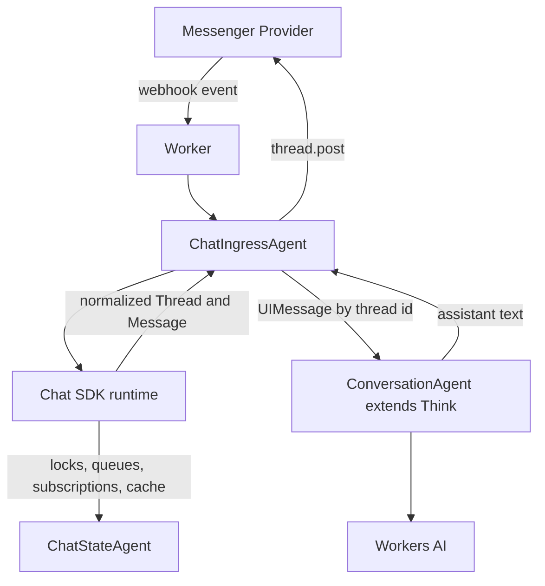

# Chat SDK Messenger Agents

This example shows how to run a [Chat SDK](https://chat-sdk.dev/) messenger
runtime inside an Agents SDK `Agent`, with subagents for Chat SDK state and
Think-backed AI replies.

Telegram is the concrete adapter used here so the example is runnable as a bot,
but the architecture is not Telegram-specific. Chat SDK can host multiple
messenger adapters in one `Chat()` instance, so the same ingress/state/AI shape
can be adapted to Slack, Discord, Teams, Google Chat, or another Chat SDK
adapter.

## What This Shows

- A top-level `ChatIngressAgent` owns the Chat SDK runtime and webhook ingress.
- Telegram webhooks enter through Chat SDK and are normalized into Chat SDK
  `Thread` and `Message` objects.
- `ChatStateAgent` backs Chat SDK subscriptions, locks, queues, cache, and
  lists as an Agents SDK subagent.
- `ConversationAgent extends Think` owns AI message history and model calls per
  Chat SDK `thread.id`.
- The provider boundary stays narrow: Telegram setup/rendering lives at ingress,
  while state and AI behavior stay reusable.

## Run Locally

Install dependencies from the repo root:

```bash
npm install
```

Create a Telegram bot with [BotFather](https://t.me/BotFather), then set local
environment variables:

```bash
cp .env.example .dev.vars
```

Fill in:

```bash
TELEGRAM_BOT_TOKEN=your-bot-token-from-botfather
TELEGRAM_WEBHOOK_SECRET_TOKEN=generate-a-random-secret
TELEGRAM_BOT_USERNAME=your_bot_username
```

Start Wrangler:

```bash
npm run dev
```

Expose Wrangler's local port with a tunnel:

```bash
cloudflared tunnel --url http://localhost:8787
```

Set the Telegram webhook to your tunnel URL:

```bash
curl -X POST "https://api.telegram.org/bot$TELEGRAM_BOT_TOKEN/setWebhook" \
  -H "Content-Type: application/json" \
  -d '{
    "url": "https://your-tunnel.example.com/webhooks/telegram",
    "secret_token": "'"$TELEGRAM_WEBHOOK_SECRET_TOKEN"'"
  }'
```

Then DM your bot. Send `/menu` for the demos or any other message for an AI
reply. In groups, mention the bot to subscribe the thread; after that, mention
the bot again or send `/ask ...` for AI, `/menu` for demos, or `/reset` to clear
that thread's AI history.

This example also uses Workers AI. With the `remote` binding in
`wrangler.jsonc`, local AI calls run against your Cloudflare account.

## Deploy

Store secrets:

```bash
wrangler secret put TELEGRAM_BOT_TOKEN
wrangler secret put TELEGRAM_WEBHOOK_SECRET_TOKEN
wrangler secret put TELEGRAM_BOT_USERNAME
```

Deploy:

```bash
npm run deploy
```

Open the deployed Worker root URL to see a generated Telegram `setWebhook`
command for `/webhooks/telegram`. The setup page intentionally prints
`$TELEGRAM_WEBHOOK_SECRET_TOKEN` as a placeholder instead of echoing the stored
secret.

## Architecture

The core pattern is one Chat SDK ingress Agent plus two subagent roles:



The Worker binds only the top-level `ChatIngressAgent`:

```jsonc
"durable_objects": {
  "bindings": [
    { "name": "ChatIngressAgent", "class_name": "ChatIngressAgent" }
  ]
}
```

Everything else is reached as a subagent:

```text
ChatIngressAgent
  Chat({ adapters: { telegram } })
  ChatStateAgent       # Chat SDK infrastructure state
  ConversationAgent    # Think messages and model calls per thread
```

`ChatIngressAgent` creates one Chat SDK runtime during `onStart()`:

```ts
export class ChatIngressAgent extends Agent {
  onStart() {
    this.bot = this.createBot();
  }

  private createBot() {
    return new Chat({
      userName,
      adapters: { telegram },
      state: createAgentChatState({ parent: this }),
      concurrency: { strategy: "burst", debounceMs: 600 }
    });
  }
}
```

To adapt this example to another messenger, replace or add adapters in that
`Chat()` call and adjust the webhook/setup route. The state adapter and Think
conversation subagent do not need to know which messenger produced the message.

## Adapting To Another Messenger

The provider-specific part of this example is intentionally small:

- Import or create another Chat SDK adapter.
- Add it to the `adapters` object in `createBot()`.
- Route that provider's webhook path to the same `ChatIngressAgent`.
- Adjust menu/actions only where the provider's UX differs.

For example, a multi-provider ingress would still share the same state and AI
subagents:

```ts
const bot = new Chat({
  userName,
  adapters: {
    telegram,
    slack,
    discord
  },
  state: createAgentChatState({ parent: this })
});
```

The important boundary is that provider adapters produce Chat SDK `Thread` and
`Message` objects. From there, `ChatStateAgent` and `ConversationAgent` stay the
same.

## State Subagent

The Chat SDK state adapter is intentionally package-shaped:

```text
src/state/
  agent.ts
  adapter.ts
  index.ts
  types.ts
```

`ChatStateAgent` is infrastructure only. It stores Chat SDK locks,
subscriptions, queues, generic cache values, and lists in Durable Object SQLite.
It should not own channel personality, tools, or reasoning.

The community
[`chat-state-cloudflare-do`](https://github.com/dcartertwo/chat-state-cloudflare-do)
package covers the generic Workers story: bring a Durable Object binding and
use it as a Chat SDK state adapter. This example shows the Agents SDK version:
if your app already has an Agent, Chat SDK state can live in a subagent instead
of a separate top-level binding.

## Think-Backed Replies

The AI path is small on purpose:

```text
src/intelligence/
  conversation-agent.ts  # ConversationAgent extends Think
  messages.ts            # Chat SDK Message -> AI SDK UIMessage helpers
```

`ConversationAgent` uses Think's `messages` / Session storage as the canonical
AI history for one Chat SDK `thread.id`. Chat SDK history remains
platform/event history and optional source material for later backfill.

The response path uses Think's `chat()` RPC stream and relays text deltas into
Chat SDK's streaming post API from a managed fiber:

```ts
await this.startFiber(
  "chat-sdk-messenger:ai-reply",
  async (fiber) => {
    fiber.stash({
      type: "chat-sdk-messenger:ai-reply",
      stage: "accepted",
      thread: thread.toJSON(),
      message: message.toJSON()
    });
    await this.answerWithConversationAgent(thread, message, fiber);
  },
  {
    idempotencyKey: `ai-reply:${thread.id}:${message.id}`,
    waitForCompletion: true
  }
);

// Inside answerWithConversationAgent:
// - start a Chat SDK streaming post
// - call Think's chat() with a StreamCallback
// - checkpoint completed state when the stream finishes
```

This keeps visible messenger writes under application control while still
exercising Think's durable message ownership and streaming turn API. The
callback receives Think's request id in `onStart`, so the ingress agent can call
`cancelChat()` on the conversation sub-agent if the messenger stream fails. The
managed fiber gives webhook retries a stable idempotency boundary.
`waitForCompletion: true` keeps the Chat SDK handler open until the visible reply
finishes, so Chat SDK's per-thread concurrency strategy still serializes user
visible replies. The serialized Chat SDK thread/message snapshots give recovery
code enough context to restore the reply target after a restart.

Recovery has an explicit visible policy. If the fiber was interrupted before
streaming began, `onFiberRecovered()` restores the Chat SDK thread/message and
replays the AI reply, then returns `{ status: "completed" }` to settle the
managed fiber. If the interruption happened after streaming began, the bot posts
a concise interruption apology and also settles the fiber as completed. Duplicate
webhooks for already completed replies are ignored; duplicates for interrupted
replies trigger the same recovery policy once, then resolve the retained fiber.

`waitForCompletion: true` preserves one visible AI reply at a time per Chat SDK
thread by keeping the Chat SDK handler pending until the managed fiber reaches a
terminal status. That keeps durable webhook acceptance from bypassing the Chat
SDK burst/debounce UX and avoids overlapping Telegram placeholder or streaming
messages.

## Production Behavior

The example keeps the retry and recovery policy explicit so it is easy to adapt
for other providers:

- The managed fiber idempotency key is
  `ai-reply:${thread.id}:${message.id}`. Provider retries for the same Chat SDK
  message reuse the retained fiber instead of starting a second visible reply.
- `waitForCompletion: true` keeps the Chat SDK handler pending until the visible
  reply work reaches a terminal managed-fiber status. This preserves Chat SDK's
  per-thread burst/debounce behavior for visible replies.
- Long model turns can still exceed provider webhook timeouts. If Telegram
  retries while the original reply is running in the same isolate, the duplicate
  delivery joins the active managed fiber. After a restart, the duplicate
  delivery observes the retained status and either returns or runs recovery.
- `completed` duplicate deliveries are ignored because the visible reply already
  finished.
- `interrupted` duplicate deliveries restore the serialized Chat SDK
  thread/message snapshot, run the same recovery policy, and call
  `resolveFiber()` after application-level recovery succeeds.
- `error` and `aborted` fibers are terminal. This example does not auto-retry
  them; a production bot could add an operator command, retry button, or manual
  reconciliation flow.

Future iterations can use Chat SDK `createChatTools` once there is an approval
UX for model-driven writes.

## Telegram Behavior

Telegram is the included adapter, so the sample handlers are written around
Telegram bot UX:

- Direct messages receive an AI response unless the message is `/menu` or
  `/reset`.
- In groups, the bot subscribes the thread on first mention.
- In subscribed group threads, the bot responds only to later mentions or
  messages starting with `/ask`.
- `/menu` opens the Chat SDK demo menu.
- `/reset` clears the Think conversation for the current Chat SDK thread.

## Scaling This Up

The current `getIngressAgentName()` helper returns `default`. A larger app
could route to different parent Agent names by tenant, bot, or chat after
verifying the webhook and parsing the update at the Worker boundary:

```text
ChatIngressAgent:tenant-a
  ChatStateAgent:telegram:-100123
  ChatStateAgent:slack:T123

ChatIngressAgent:tenant-b
  ChatStateAgent:discord:987
```

## Caveats

- Telegram webhook URLs must be public. Local tunnel URLs change, so run
  `setWebhook` again when your tunnel changes.
- Use `TELEGRAM_WEBHOOK_SECRET_TOKEN` in production so Telegram signs webhook
  requests.
- Telegram callback data is limited to 64 bytes. Keep button action IDs short.
- Telegram bots cannot fetch complete historical chat logs. Adapter history is
  limited to what the bot can see/cache.
- The AI path streams assistant text only. Reasoning, tool calls, and tool
  results are intentionally not rendered into the messenger yet.
- The `default` parent Agent is intentionally simple; high-volume bots should
  consider routing to more specific parent Agent names.

## Related

- [Chat SDK](https://chat-sdk.dev/)
- [Chat SDK Telegram adapter](https://chat-sdk.dev/adapters/official/telegram)
- [Chat SDK state adapters](https://chat-sdk.dev/docs/state)
- [Chat SDK AI helpers](https://chat-sdk.dev/docs/ai)
- [`chat-state-cloudflare-do`](https://github.com/dcartertwo/chat-state-cloudflare-do)
